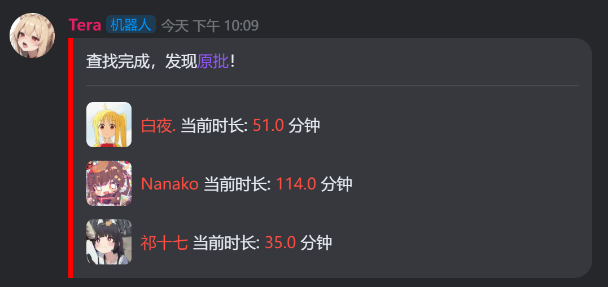

<div align="center">

# nonebot-plugin-op-finder

_✨ Only for kaiheila adaptor ✨_

<a href="./LICENSE">
    
</a>
<a href="https://pypi.python.org/pypi/nonebot-plugin-op-finder">
    
</a>


</div>

## 📖 介绍

显示服务器中当前正在玩原神的玩家，效果图见下文。

## 💿 安装

<details open>
<summary>使用 nb-cli 安装</summary>
在 nonebot2 项目的根目录下打开命令行, 输入以下指令即可安装

    nb plugin install nonebot-plugin-op-finder

</details>

<details>
<summary>使用包管理器安装</summary>
在 nonebot2 项目的插件目录下, 打开命令行, 根据你使用的包管理器, 输入相应的安装命令

<details>
<summary>pip</summary>

    pip install nonebot-plugin-op-finder
</details>
<details>
<summary>pdm</summary>

    pdm add nonebot-plugin-op-finder
</details>
<details>
<summary>poetry</summary>

    poetry add nonebot-plugin-op-finder
</details>
<details>
<summary>conda</summary>

    conda install nonebot-plugin-op-finder
</details>

打开 nonebot2 项目根目录下的 `pyproject.toml` 文件, 在 `[tool.nonebot]` 部分追加写入

    plugins = ["nonebot_plugin_op_finder"]

</details>

## ⚙️ 配置

kaiheila adaptor 相关配置请见[kaiheila adaptor 使用指南](https://github.com/Tian-que/nonebot-adapter-kaiheila/blob/master/MANUAL.md)

本插件需要在 nonebot2 项目的`.env`文件中添加下表中的配置

| 配置项 | 必填 | 默认值 | 说明 |
|:-----:|:----:|:----:|:----:|
| kook_auth_key | 是 | 无 | 自己账号的kook鉴权cookie |

因为目前KOOK v3 api中没有获得玩家在玩状态的接口，本插件通过v2 api获取玩家在玩状态。

由于v2 api不受官方支持，需要手动抓包获取一个账号的鉴权cookie，用以调用api。

1. 登录网页版KOOK，随便进入一个服务器，打开浏览器控制台
2. 控制台切换到Network(网络)选项卡
3. KOOK中随意点击一个用户的头像，打开资料面板
4. 此时Network选项卡中应会抓到若干请求，随意选择一个v2api的请求查看，如 `https://www.kookapp.cn/api/v2/users/<用户id>?guild_id=<服务器id>`
5. 查看请求的Headers选项卡中的Request Headers(请求头)，找到Cookie键，形如
   
   ```
   Cookie: auth=<kook_auth_key>; PHPSESSID=<something>; _csrf_chuanyu=<something>
   ```

6. 其中<kook_auth_key>即为我们需要的配置项

> **此实在是不得已而为之的下策，若v3 api有获取在玩状态的方法，或更方便获取v2 api auth key的方法，敬请告知。**

## 🎉 使用
### 指令表
| 指令 | 权限 | 需要@ | 范围 | 说明 |
|:-----:|:----:|:----:|:----:|:----:|
| /查找原批 \|\| /原批 \|\| /op | 所有人 | 否 | 群聊 | 触发插件 |

> **指令命名纯属调侃，无恶意**

### 效果图

